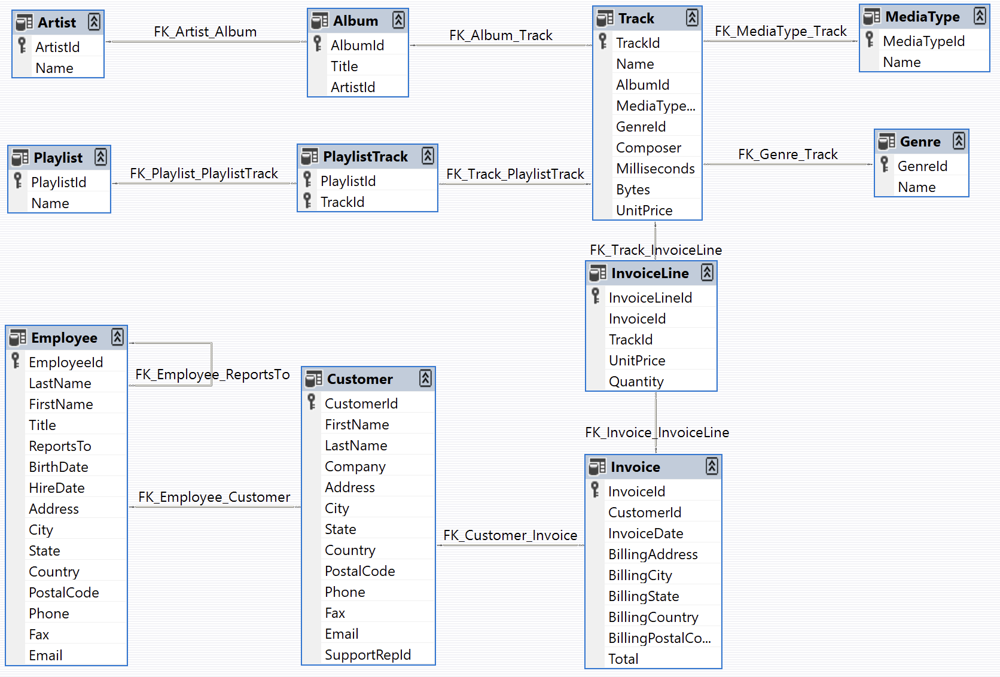
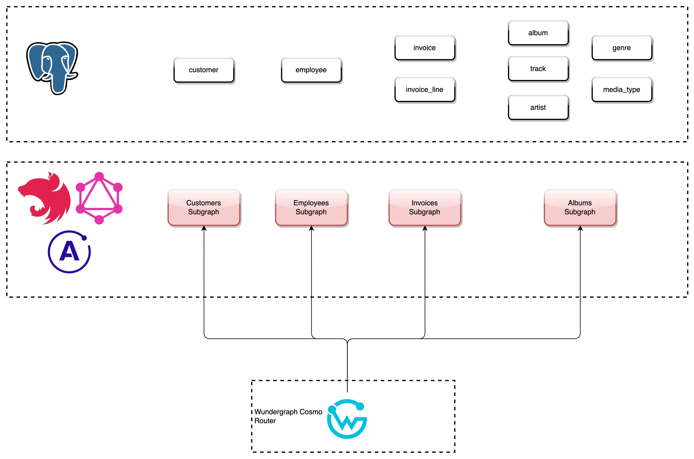
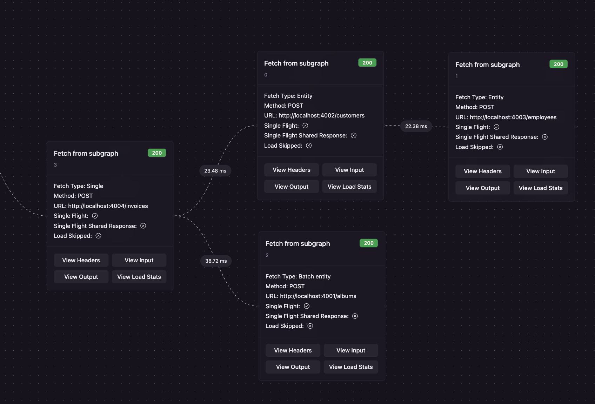

---
## Wundergraph Router Federation
---
### Wundergraph | NestJs | Apollo GraphQL | Graph Federation | Postgres

This repo has multiple NestJs + Apollo GraphQL apps created on top of Chinook sample data. The motive of this application is to showcase Wundergraph Federation with a locally running Wundergraph Cosmo Router.

---
## Chinook Sample Database
---

The Chinook data model represents a digital media store, including tables for artists, albums, media tracks, invoices and customers. Media related data was created using real data from an iTunes Library. Customer and employee information was created using fictitious names and addresses that can be located on Google maps, and other well formatted data (phone, fax, email, etc.). Sales information was auto generated using random data for a four year period.

The basic characteristics of Chinook include:
* 11 tables
* A variety of indexes, primary and foreign key constraints
* Over 15,000 rows of data

Here’s an ER diagram of the Chinook data model:



---
## Federation Architecture
---

Below is the GraphQL Federation architecture diagram:


---
## Local Deployment
---
### Pre-Requisites:
1. Install Wundergraph CLI:
```commandline
npm install -g wgc@latest
```
2. Install npm packages for local run:
```commandline
npm install
```
3. Download and extract the latest Wundergraph Cosmo Router build for your system:
   [Wundergraph Cosmo Router](https://github.com/wundergraph/cosmo/releases?q=router&expanded=true)

For macOS:
```commandline
wget https://github.com/wundergraph/cosmo/releases/download/router%400.78.0/router-router@0.78.0-darwin-amd64.tar.gz
tar -xf router-router@0.78.0-darwin-amd64.tar.gz
```

Wundergraph Cosmo Router should be present in the Project Root path.

### Deployment
#### Docker

* Run Docker Compose script to run Postgres and all NestJs subgraphs:
```commandline
npm start
```

* Cleanup:
```commandline
npm run cleanup
```

#### Without Docker
* Postgres DB should be running in local/ remote with Chinook Data already loaded. Update the database details in `.local.env` file

* Run npm install for all apps:
```commandline
npm run install:local
```

* Start all apps in parallel:
```commandline
npm run start:local
```

---
## Result
---
Use the below GraphQL query in the Wundergraph Explorer to fetch details of an Invoice which traverses through all entities:

```graphql
query InvoiceDetails {
  invoice(invoice_id: 2) {
    total
    invoice_date
    billing_address
    billing_city
    customer {
      first_name
      last_name
      support_rep {
        first_name
        last_name
        supervisor {
          first_name
          last_name
        }
      }
    }
    invoiceLines {
      quantity
      unit_price
      track {
        name
        unit_price
        milliseconds
        media_type_id
        composer
        bytes
        album {
          title
          artist {
            name
          }
        }
        genre {
          name
        }
        mediaType {
          name
        }
      }
    }
  }
}
```

Below is the Output of the query:

```json
{
  "data": {
    "invoice": {
      "total": 3.96,
      "invoice_date": "2021-01-02T00:00:00.000Z",
      "billing_address": "Ullevålsveien 14",
      "billing_city": "Oslo",
      "customer": {
        "first_name": "Bjørn",
        "last_name": "Hansen",
        "support_rep": {
          "first_name": "Margaret",
          "last_name": "Park",
          "supervisor": {
            "first_name": "Nancy",
            "last_name": "Edwards"
          }
        }
      },
      "invoiceLines": [
        {
          "quantity": 1,
          "unit_price": 0.99,
          "track": {
            "name": "Put The Finger On You",
            "unit_price": 0.99,
            "milliseconds": 205662,
            "media_type_id": 1,
            "composer": "Angus Young, Malcolm Young, Brian Johnson",
            "bytes": 6713451,
            "album": {
              "title": "For Those About To Rock We Salute You",
              "artist": {
                "name": "AC/DC"
              }
            },
            "genre": {
              "name": "Rock"
            },
            "mediaType": {
              "name": "MPEG audio file"
            }
          }
        },
        {
          "quantity": 1,
          "unit_price": 0.99,
          "track": {
            "name": "Inject The Venom",
            "unit_price": 0.99,
            "milliseconds": 210834,
            "media_type_id": 1,
            "composer": "Angus Young, Malcolm Young, Brian Johnson",
            "bytes": 6852860,
            "album": {
              "title": "For Those About To Rock We Salute You",
              "artist": {
                "name": "AC/DC"
              }
            },
            "genre": {
              "name": "Rock"
            },
            "mediaType": {
              "name": "MPEG audio file"
            }
          }
        },
        {
          "quantity": 1,
          "unit_price": 0.99,
          "track": {
            "name": "Evil Walks",
            "unit_price": 0.99,
            "milliseconds": 263497,
            "media_type_id": 1,
            "composer": "Angus Young, Malcolm Young, Brian Johnson",
            "bytes": 8611245,
            "album": {
              "title": "For Those About To Rock We Salute You",
              "artist": {
                "name": "AC/DC"
              }
            },
            "genre": {
              "name": "Rock"
            },
            "mediaType": {
              "name": "MPEG audio file"
            }
          }
        },
        {
          "quantity": 1,
          "unit_price": 0.99,
          "track": {
            "name": "Breaking The Rules",
            "unit_price": 0.99,
            "milliseconds": 263288,
            "media_type_id": 1,
            "composer": "Angus Young, Malcolm Young, Brian Johnson",
            "bytes": 8596840,
            "album": {
              "title": "For Those About To Rock We Salute You",
              "artist": {
                "name": "AC/DC"
              }
            },
            "genre": {
              "name": "Rock"
            },
            "mediaType": {
              "name": "MPEG audio file"
            }
          }
        }
      ]
    }
  }
}
```

Wundergraph Trace:


---
## TODO/ Future Work:
---
* Caching implementation
* Authentication/ Authorization
* GraphQL Dataloader to address N+1 queries problem (https://github.com/graphql/dataloader)
* Logging
* Exception Handling
* Pagination